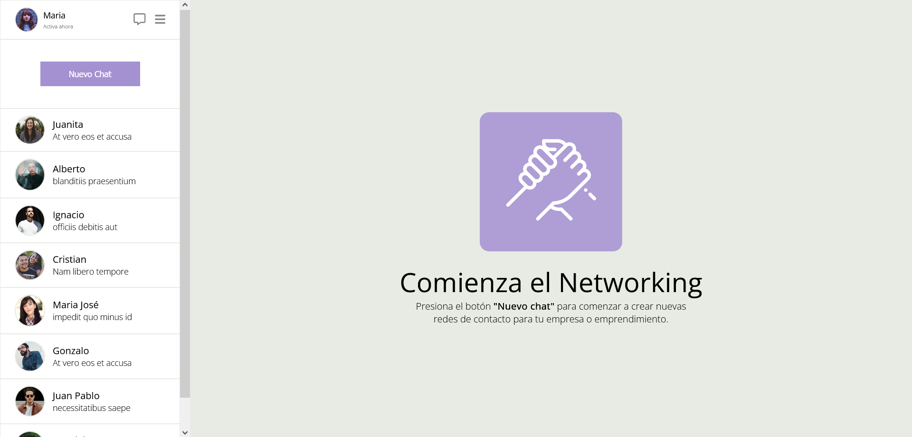

# Desafío 1 - CSS avanzado - Sistema de Mensajería 🚀

## Introducción
¡Hola a todos! En esta ocasión trabajé en el sistema de mensajería para Contact Me SPA utilizando Flexbox. Vamos a echar un vistazo a lo que logré.

## Descripción del Proyecto
En este desafío, tuve la oportunidad de aplicar mis conocimientos de Flexbox para diseñar una interfaz de mensajería y contactos. La pantalla requería que posicionara las columnas de contactos y la sección principal utilizando únicamente Flexbox, además de centrar el logo y los textos en la sección principal.

## Resultado Final 🎉
Aquí está el resultado final de mi proyecto:

### Observaciones y Recomendaciones
- Utilicé flexbox para posicionar las secciones de contactos y la sección principal.
- En la sección de contactos, cada contacto muestra su nombre, imagen y el último mensaje enviado.
- Dentro de la sección de contactos, con el fin de facilitar el recorrido del usuario, he agregado una barra de desplazamiento vertical.
- Agregué el botón "Nuevo Chat" en la sección de contactos, centrado y posicionado con Flex.
- En la sección principal, logré centrar el logo y los textos.

## Experiencia del Desarrollo
Este proyecto fue un gran desafío que me permitió aplicar y fortalecer mis conocimientos de Flexbox.